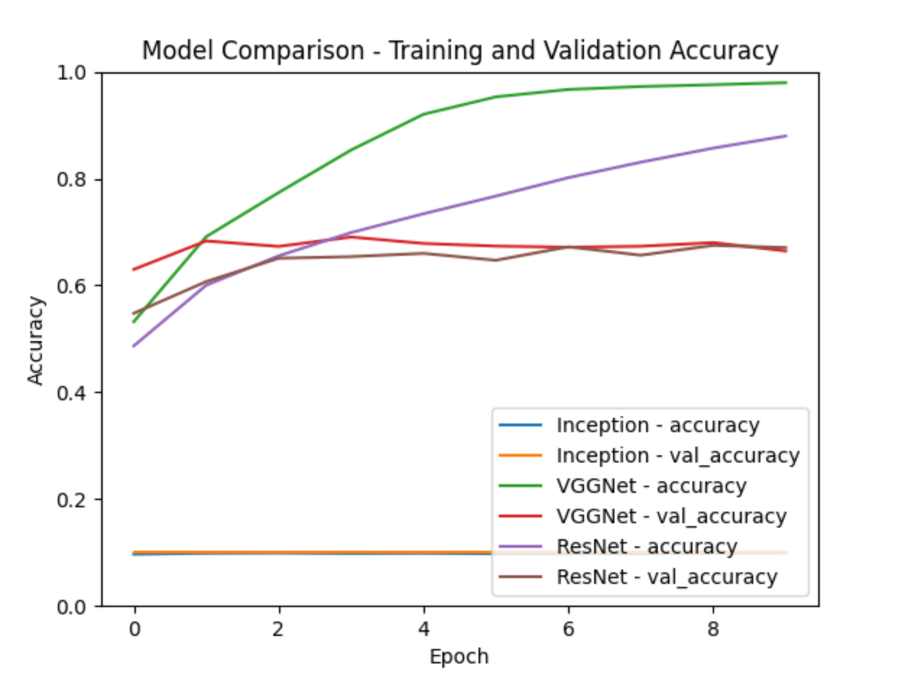

## Assignment Question 3 : Image Classification with CNNs
## --------------------------------------------------------------------------------
### 1. **Inception (GoogleNet):**
   - **Reasons for Choosing:**
      - Inception modules allow the model to capture information at different scales by using filters of various sizes within the same layer.
      - It addresses the vanishing gradient problem by introducing parallel pathways with different receptive fields.
      - Inception is computationally efficient compared to models with a large number of parameters.

   - **Advantages:**
      - Increased model expressiveness without a significant increase in parameters.
      - Effective in capturing both fine and coarse-grained features.
      - Suitable for image classification tasks with complex structures.

### 2. **VGGNet:**
   - **Reasons for Choosing:**
      - VGGNet has a simple and uniform architecture with a stack of convolutional layers followed by max-pooling layers.
      - The consistent 3x3 filter size throughout the network simplifies the model design.
      - Its simplicity makes it a good baseline model for image classification tasks.

   - **Advantages:**
      - Easy to understand and implement due to its uniform architecture.
      - Good performance on image classification tasks.
      - The use of small filters allows the model to capture local features effectively.

### 3. **ResNet:**
   - **Reasons for Choosing:**
      - ResNet introduced the concept of residual learning, which helps mitigate the vanishing gradient problem in deep networks.
      - Skip connections allow the model to learn identity mappings, making it easier to train very deep networks.
      - ResNet architectures have been successful in various computer vision tasks.

   - **Advantages:**
      - Improved training of very deep networks with hundreds of layers.
      - Residual connections enable the model to learn both low-level and high-level features.
      - Effective in handling vanishing/exploding gradient issues during training.

### General Considerations:
   - **Transfer Learning:** All three models (Inception, VGGNet, ResNet) have pre-trained versions on large datasets (e.g., ImageNet), making them suitable for transfer learning in scenarios where data is limited.
   - **Model Complexity:** The choice of models considers a trade-off between model complexity and computational efficiency. Inception and ResNet strike a balance between expressive power and computational cost.

### Summary:
The selection of Inception, VGGNet, and ResNet depends on factors such as the complexity of the dataset, available computational resources, and the specific requirements of the image classification task. Inception is suitable for tasks with intricate structures, VGGNet offers simplicity, and ResNet is well-suited for very deep networks. Each model has its advantages, and the choice depends on the specific characteristics of the problem at hand.

### Findings:

It compares the training and validation accuracy of three different machine learning models: Inception, VGGNet, and ResNet over eight epochs. The graph shows that Inception has the highest accuracy, followed by VGGNet and ResNet.

The x-axis is labeled “Epoch” ranging from 0 to 8. The y-axis is labeled “Accuracy” with values ranging from 0.0 to 1.0. There are six lines representing the training and validation accuracies of three different models: Inception (blue for accuracy, orange for val_accuracy), VGGNet (green for accuracy, red for val_accuracy), and ResNet (purple for accuracy, brown for val_accuracy). All models start with similar accuracies but diverge as the number of epochs increases. Inception model shows the highest increase in both training and validation accuracies. VGGNet’s training accuracy increases steadily but its validation accuracy remains relatively flat. ResNet shows moderate growth in training accuracy but its validation accuracy remains low.

